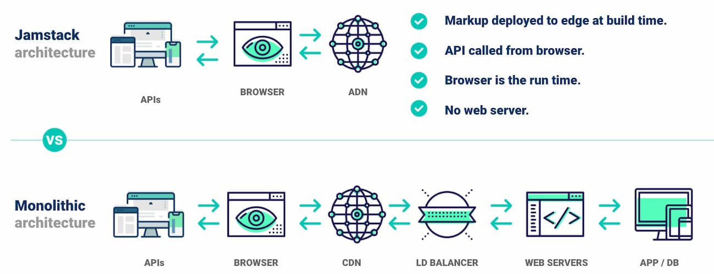

---

title: "Jamstack w/Gatsby"

date: "06-14-2021"

website: ""

github: "https://github.com/rodneycoyer/family-recipes.git"
github_icon: ""

dockerHub: "https://hub.docker.com/repository/docker/roofwalker/"
dockerHub_icon: ""

role: "creator"

isOpenSource: "false"

type: "learning"

year: ""

stack: "Gatsby, GraphQL, MongoDB, Netlify, Gatsby Cloud"

short_description: " Family Recipes && Portfolio Page"

full_description: "longer description of the project"

lessons_learned: ""

image01: "./image01.png"
image01_alt: "recipes index page"

image02: ""
image02_alt: ""

image03: ""
image03_alt: ""

image04: ""
image04_alt: ""

image05: ""
image05_alt: ""

tags: ["jamstack", "gatsby", "graphQl", "react", "react-bootstrap", "netlify", "aws", "ec2", "s3", "cloud-front"]

---

*updated : 1/20/2022

## Mission

I was listening to an interview on Software Engineering Daily (SED) and the host was interviewing an Engineer from Netlify. They were discussing building projects with Jamstack and deploying to cloud providers like AWS or Netlify.

I wanted to explore and learn about about these conepts, build and deployments strategies. I ended up writing a couple of projects, including this website, with Jamstack technologies and contributing to Netlify CLI 🎉.

In this write up, I'll be looking over the 2 Jamstack projects built.

## Jamstack 

Its an architecture style that is powered with Javascript, APIs, and Markup. It's easy to develop with, content is served faster, easier to scale, and more secure than the traditional approach. Prerendered content such as, static files, are served to a CDN and hydrated when its building, orloading, using serverless functions, hooks, and APIs.

 

 

## Goals

These are some core features and concepts I wanted to learn and practice:

- React Hooks - context, state, effect
- Material UI
- GraphQL - Schemas, Queries and Mutations
- API Plugins
- Gatsby Plugins
  - images
- Programmatically create:
  - resource pages
  - resource fs directories
  - links
  - fs directories
- Connect with MongoDB
- Deploy Build
  - Netlify
  - Gatsby Cloud
- Docker

In the end, when a user make a request to the browser, appropriate static contents will be sent back to the user and hydrated while the app is building, or loading. During deveopment, when production changes are ready, the project repo is monitored and deployed with Netlify or Gatsby Cloud.
