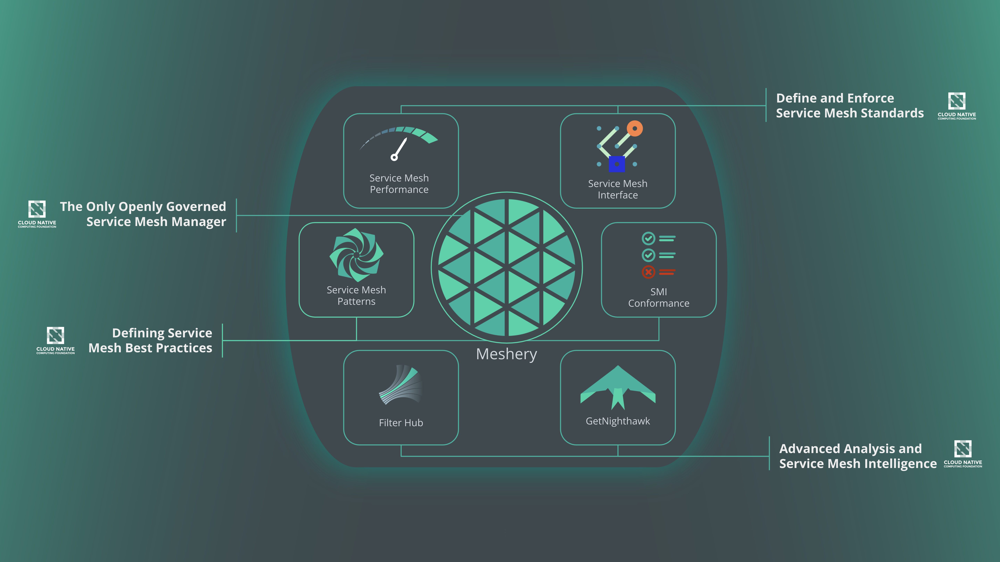

---

title: "Layer5"

date: "01-14-2022"

website: "https://layer5.io/"

github: "https://github.com/layer5io/layer5"

dockerHub: "https://hub.docker.com/u/layer5/"

role: "contributor"

isOpenSource: "true"

type: "open-source"

context: "Front End"

year: ""

stack: "Gatsby, Material-UI"

short_description: "Cloud Native Application and Infrastructure Management"

full_description: "Layer5 offers microservices and tools to help organizations manage their infrastructure while hosting applications across the cloud."

lessons_learned: ""

thumbnail01: "./layer5.png"
thumbnail01_alt: "layer5 icon"

image01: "./layer5-home.png"
image01_alt: "the service mesh company"

image02: ""
image02_alt: ""

image03: ""
image03_alt: ""

image04: ""
image04_alt: ""

image05: ""
image05_alt: ""

tags: ["gatsby", "react", "styled-components", "material-ui", "open-source", "front-end", "contribution"]

---

## Layer5 Overview   

Layer 5 represents the "session" layer of the Open Systems Interconnect (OSCI) Model. It establishes, coordinates, and manages communication of sessions between 2 or more applications or processes. Sessions consist of requests and responses between apps or processes. The session data can then be sychronized and merged into a single stream.

Layer5.io is an open-source community that builds and maintains tools related to cloud-native application infrastructure. When a project grows, so does its infrastructure needs. Layer5.io has developed an ecosystem giving developers tools to configure, manage, and test workload performances.

> "*Expect more from your infrastructure.*"
>
> *Layer5.io*

  

## Contribution

I'm interested in learning more about infrastructure and was looking for an issue I could contribute to. Unfortunately, I didn't know RUST or have enough understanding yet. However, their main site is created with Gatsby. So I looked for some front-end issues I could help with and joined the Layer5.io community.

### Issue 🚩

❌ <a style="color: #ffa726; text-decoration: none" href="https://github.com/layer5io/layer5/issues/2435" target="_blank" rel="noreferrer"> Handbook icons not responsive </a>

One of their webpages had issues with its icon responsiveness. When inspecting the page, the code was written with inline-styles and the icons pixels were being reduced with css "rem" units. HTML white-spaces and line-break elements were also seen throughout.

### Solution 💡

I needed to clean this area up and do some consolodation. When I was inspecting the page, I saw that the markdown files were being styled using SASS with MUI styled-components. I wanted to double those files and check for a solution that may already exist. There wasn't any so I rolled my own and created a class that targeted everything I needed.

After fixing the icon styles and removing the HTML white-spaces and line-breaks, I added aria-label tags where they were missing before I tested and submitted a PR.

